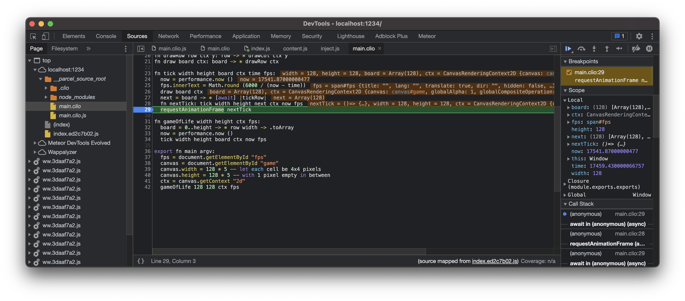

Google Chrome / Chromium
========================

Google Chrome and Chromium browsers support sourcemaps out of the box and they recognize
``.clio`` files without a problem. To debug a Clio web app using Chrome or Chromium head
over to the web app, open the `Chrome developer tools`_, then select the Sources tab.

On the left side of the Sources tab you can see a list of the source files used in
your web app, you can click on any of the ``.clio`` files there to reveal its content.
You can set breakpoints in the Clio files and debug them, just as you would normally do
with the JavaScript files.

The value of the local variables are displayed inline and also on the right pane of
the Sources tab. On the right pane, you can find more useful information that can help
you debug your app. For more information you can visit the official Chrome docs_.

  Debugging Clio using Chrome DevTools

.. _`Chrome developer tools`: https://developer.chrome.com/docs/devtools/open
.. _docs: https://developer.chrome.com/docs/devtools/javascript