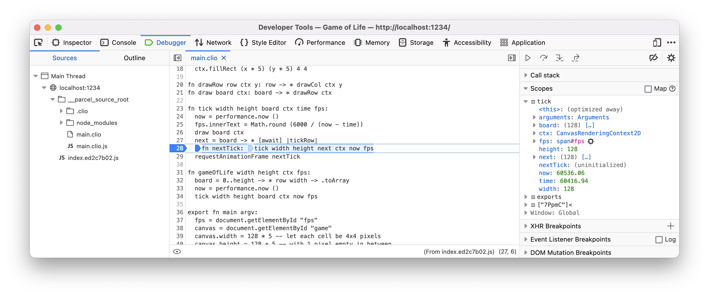

Mozilla Firefox
===============

The Mozilla Firefox browser support sourcemaps out of the box and they recognize
``.clio`` files without a problem. To debug a Clio web app using Mozilla Firefox head
over to the web app, open the `Firefox developer tools`_, then select the Sources tab.

On the left side of the Sources tab you can see a list of the source files used in
your web app, you can click on any of the ``.clio`` files there to reveal its content.
You can set breakpoints in the Clio files and debug them, just as you would normally do
with the JavaScript files.

The value of the local variables are displayed on the right pane of the Sources tab.
On the right pane, you can find more useful information that can help you debug your
app. For more information you can visit the official Mozilla Firefox docs_.

  Debugging Clio using Firefox Developer Tools

.. _`Firefox developer tools`: https://developer.mozilla.org/en-US/docs/Tools
.. _docs: https://developer.mozilla.org/en-US/docs/Tools/Debugger