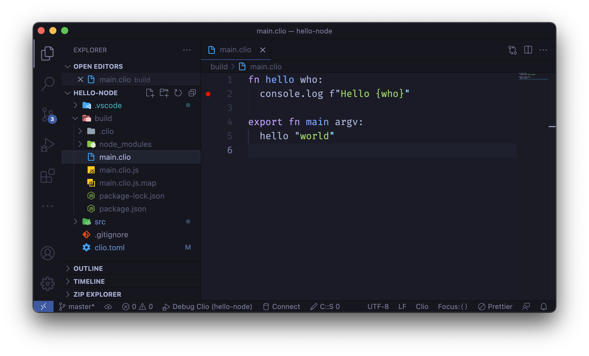
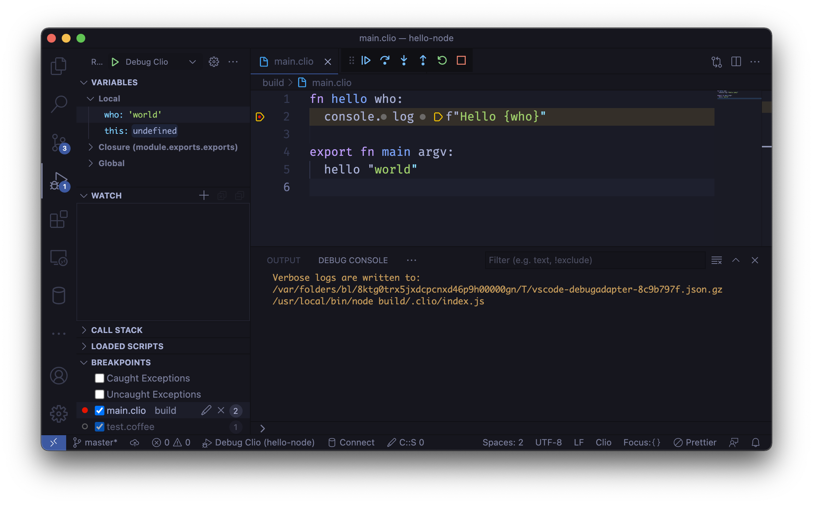

Visual Studio Code
==================

To get Clio debugging in Visual Studio Code, you should first install the official
Clio language support extension_ for VSCode, then create a ``.vscode/launch.json``
file at the root of your project directory with the following content:

.. code-block:: json

  {
    "version": "0.2.0",
    "configurations": [
      {
        "name": "Debug Clio",
        "type": "node",
        "request": "launch",
        "program": "build/.clio/index.js",
        "outFiles": ["${workspaceFolder}/build/**/*.js"],
        "resolveSourceMapLocations": ["${workspaceFolder}/build/**"],
        "trace": true,
        "sourceMaps": true,
        "smartStep": false
      }
    ]
  }

Now, head over to the build directory, open the clio files and set your breakpoints.

Once you are ready, go to the "Run and Debug" section of VSCode, select "Debug Clio"
and click on the green ``|>`` icon. The code should run and pause on your breakpoints.
You can see the local variables and some useful information on the left pane.

To learn more, you can visit the official VSCode documentation_ pages.

.. _documentation: https://code.visualstudio.com/docs/editor/debugging
.. _extension: ../tools/vscode.html