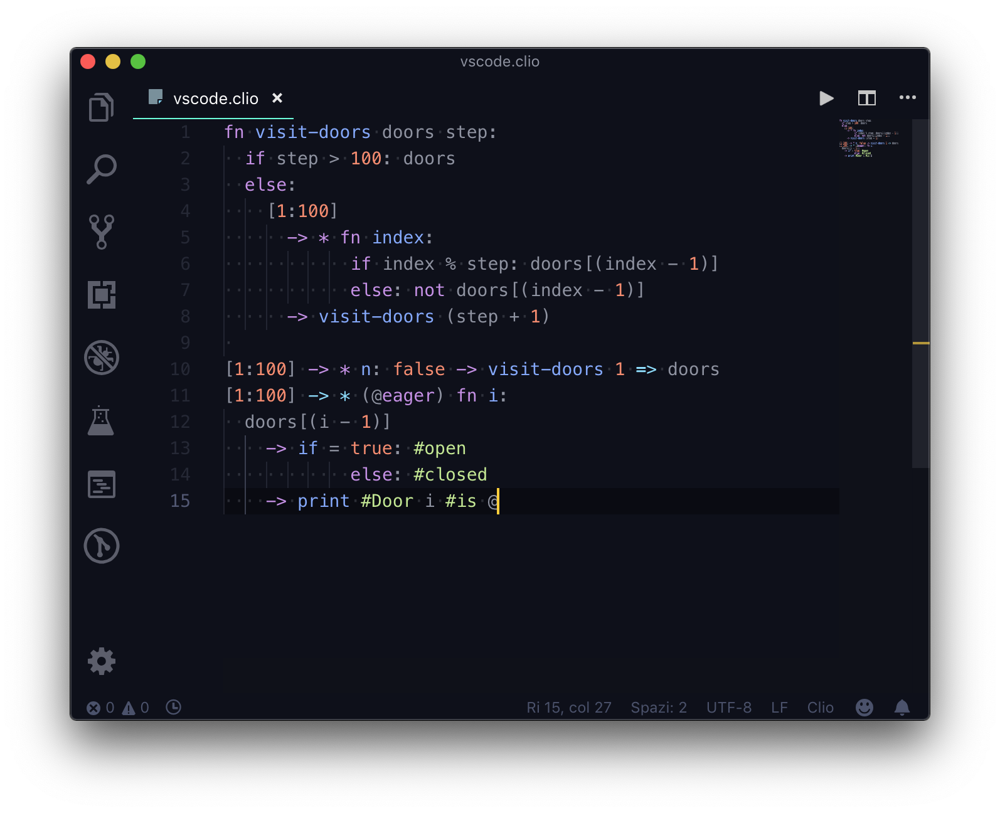

VSCode
======

Clio Language Support for Visual Studio code adds syntax highlighting, code completion,
suggestions and debugging features to VSCode. You can check the `source here`_ or check
the `package on VSCode marketplace`_.

   Clio code highlighting in VSCode using the official Clio VSCode extension

Language Server
---------------

You can install the Clio language server to get better code completion on VSCode. To enable
the Clio language server, first you need to install it using npm:

.. code-block:: bash
   
   npm i -g clio-language-server

Then, you need to head on to the Clio extension settings in VSCode and activate the feature:

.. figure:: ../_static/images/vscode-settings.png
   :alt: Visual Studio Code Clio configuration

   Find "Clio configuration" in your VSCode settings, then click on
   "Clio > Language Server: Enabled" to enable the language server support.

Contributors
------------

Special thanks to `Michele Riva`_ for creating the initial version of this
extension and special thanks to `FW`_ for his great work on the Clio language
server!

.. image:: https://contributors-img.firebaseapp.com/image?repo=clio-lang/vscode-clio
   :target: https://github.com/clio-lang/vscode-clio/graphs/contributors

.. _Michele Riva: https://github.com/micheleriva
.. _FW: https://github.com/fwcd
.. _source here: https://github.com/clio-lang/vscode-clio
.. _package on VSCode marketplace: https://marketplace.visualstudio.com/items?itemName=clio.clio-lang
